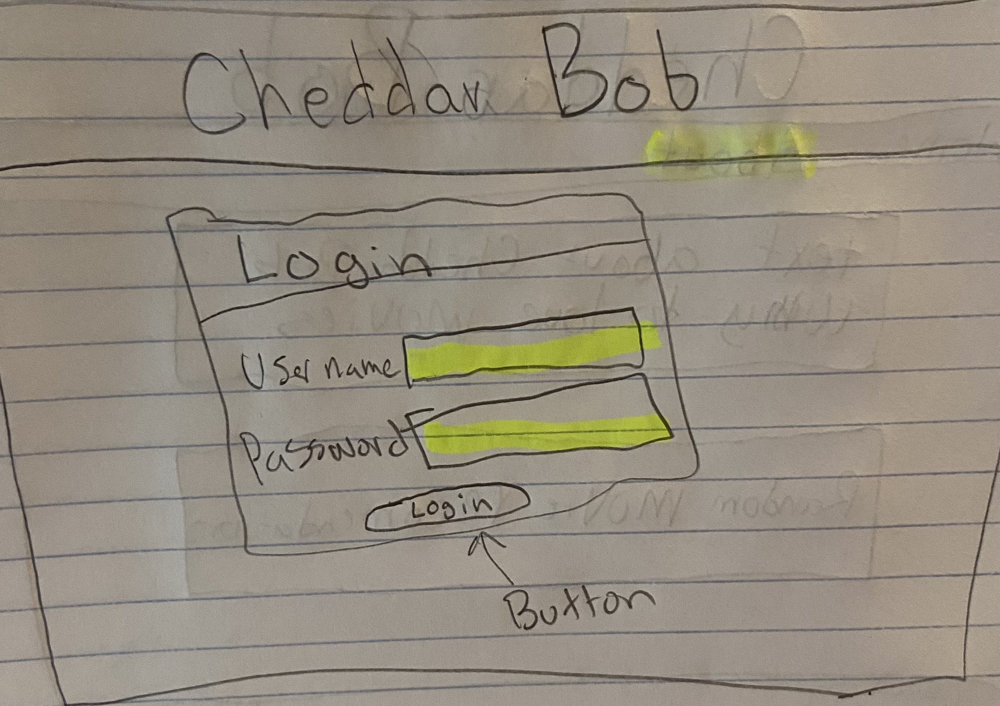
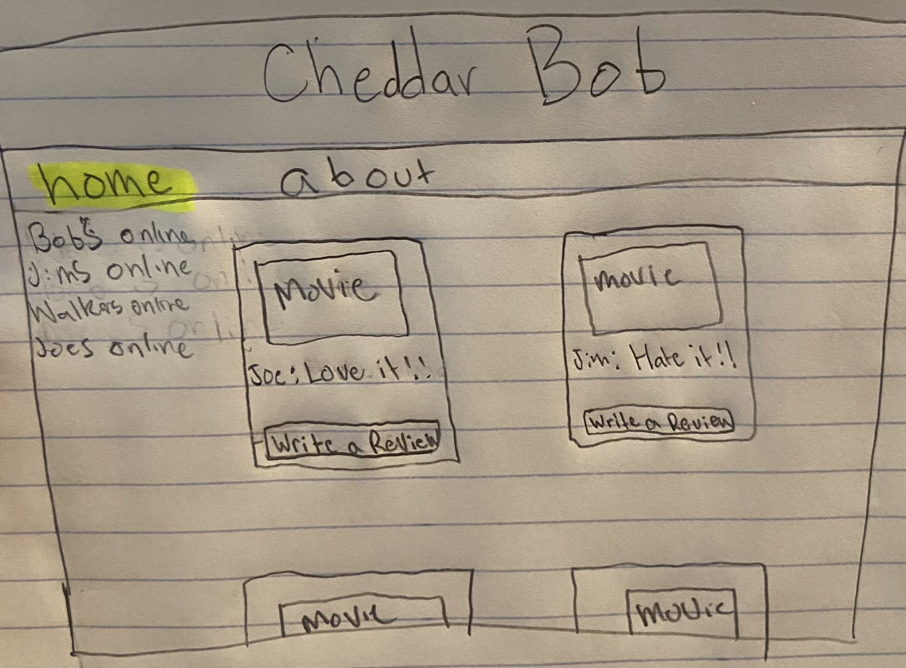
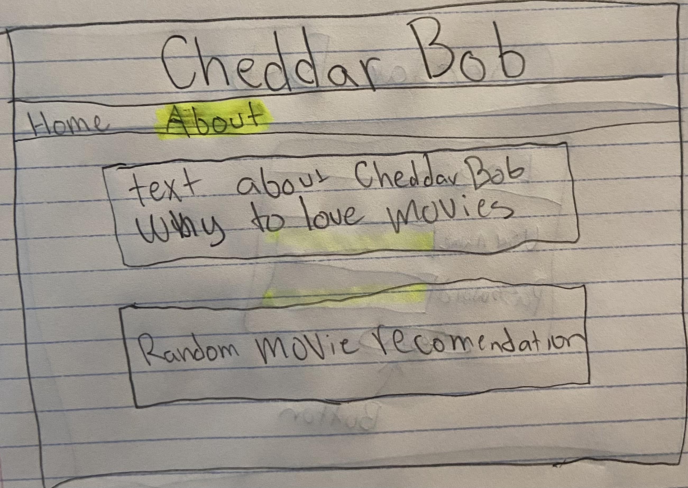

# Startup
### Elevator Pitch
Introducing Cheddar Bob, your one-stop destination for all things movies! Are you a film enthusiast or a casual moviegoer looking for the perfect film to watch tonight? Look no further. Cheddar Bob is your go-to platform for discovering, sharing, and discussing your favorite films.

With "Cheddar Bob", you can effortlessly browse through a library of movie reviews written by passionate cinephiles just like you. Get honest, real-world insights into the latest blockbusters, hidden gems, and timeless classics. Whether you're searching for heart-pounding action, heartwarming dramas, or laugh-out-loud comedies, our user-generated reviews help you make informed decisions about your next movie night.

But that's not all! "Cheddar Bob" also empowers you to become a part of our vibrant community of film buffs. Share your thoughts, opinions, and critiques by writing your own movie reviews. Express your passion for cinema, engage in spirited discussions, and connect with fellow movie lovers from around the globe.
### Design
Login Page

Home Page

About Page

### Key Features
- Secure login over HTTPS
- Ability to select the movie to read a review
- Display of movies
- Ability to select, write, and publish a review
- Reviews from all users displayed in realtime
- Reviews are persistently stored
- Ability to see who online currently
- Users also get suggested a random movie to watch on the about page
### Technologies
I am going to use the required technologies in the following ways.

- HTML - Three HTML pages. One for login, one for viewing and reviewing movies and on for an about page that also recomneds a movie to you.
- CSS - Application styling that looks good on different screen sizes, uses good whitespace, color choice and contrast.
- JavaScript - Provides login, choice display, backend endpoint calls.
- Service - Backend service with endpoints for:
  * login
  * retrieving movies
  * submitting reviews
  * retrieving random movie recomendations to watch
- DB - Store users, movies, and reviews in database.
- Login - Register and login users. Credentials securely stored in database.
- WebSocket - As each user gets on their presence is broadcast to all other users.
- React - Application ported to use the React web framework.

### HTML deliverable
For this deliverable I built out the structure of my application using HTML.

- HTML pages - Three HTML page that represent the ability to login and review movies. At somepoint a database will be connected to the index page to store and retrive user login info
- Links - The login page automatically links to the movie review page. The movie page contains movies that can be reviewed. the reviews will be stored on the database as well.
- Images - Each of the movie choices is represented by a picture of the poster as well as the title.
- Login - Input box and submit button for login. Will be stored in a database
- Database - The movie choices represent data pulled from the database. As well as the reviews being stored there with the movies.
- WebSocket - The users currently active will be shown in realtime. There will also be an API used to suggest random movies in the about page.

### CSS Deliverable

For this deliverable I properly styled the application into its final appearance.
- Header, footer, and main content body
- Navigation elements - I used bootstraps navigation element to make a clean looking navbar, I also removed the collapsable button that they implement so it always stays open
- Responsive to window resizing - My app looks great on all window sizes and devices. I tried it on my laptop, monitor and iphone.
- Application elements - I feel like I use consistent whitespace and spacing as well as the same coloring for all pages.
- Application text content - Consistent fonts
- Application images - I did image styling for all of the posters included on the website. i used class="card-group"> to style them and have them size the way I want them for consistency 

### JavaScript deliverable

For this deliverable I implemented by JavaScript so that the application works for a single user. I also added placeholders for future technology.

- login - When you press enter or the login button it takes you to the movies page.
- database - Displayed the current movie reviews that are stored locally, you can log into a differnt user and still see the reviews. Currently this is stored and retrieved from local storage, but it will be replaced with the database data later.
- WebSocket - I used the setInterval function to periodically increase a random users that will be online. I created a generate names function that makes a bunch of fake names. This will be replaced with WebSocket messages later.
- application logic - The user can write a review for any of the movies and they will apear in the display for the movies they are also stored locally for each user, you can log into new users and still see the smae reviews.

### Service deliverable
For this deliverable I added backend endpoints that receives reviews and returns the reviews to display them.

- Node.js/Express HTTP service - done!
- Static middleware for frontend - done!
- Calls to third party endpoints - this took a long time to get figured out. 😔
- Backend service endpoints - Placeholders for login that stores the current user on the server. Endpoints for reviews.
- Frontend calls service endpoints - I did this using the fetch function.
